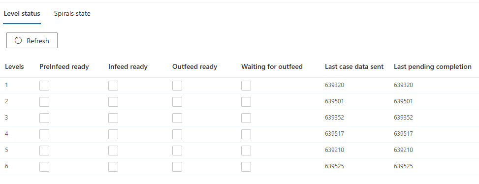
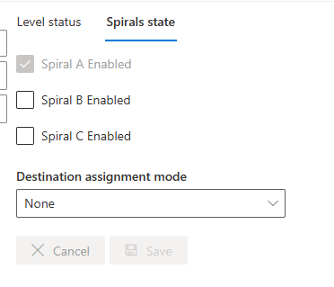

# Operations

**[Home](../../index.md) > [Main Screens](../index.md) > [Administration](index.md) > Operations**

## Level status

- This page provides an overview of each level's various statuses as well as:
  - Last case data sent (CaseRef #)
  - Last pending completion (CaseRef #)

## Spirals state

Configuration for downstream Spiral points (where the different levels combine to a single conveyor that feeds one of the palletizers).

---

### Spiral A / B / C Enabled

Enable or disable individual downstream destinations.

**Purpose:**

- Route all cases to operational Spiral if one fails
- Handle downstream equipment failures
- Temporary operational adjustments

**Usage:**

- Last resort when downstream fault cannot be resolved
- Will not affect cases already on sequence conveyors -- those cases that are already scheduled for a certain destination will retain their destination.
- High likelihood that remote support interventions will be required if this is changed during production.

**Caution**: *Only use when absolutely necessary and coordinate with support. Can have unintended effects and complications.*

---
