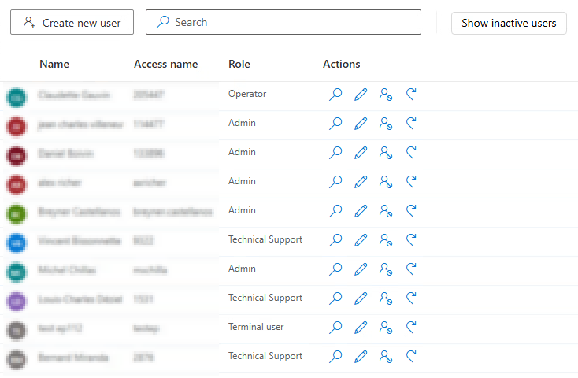
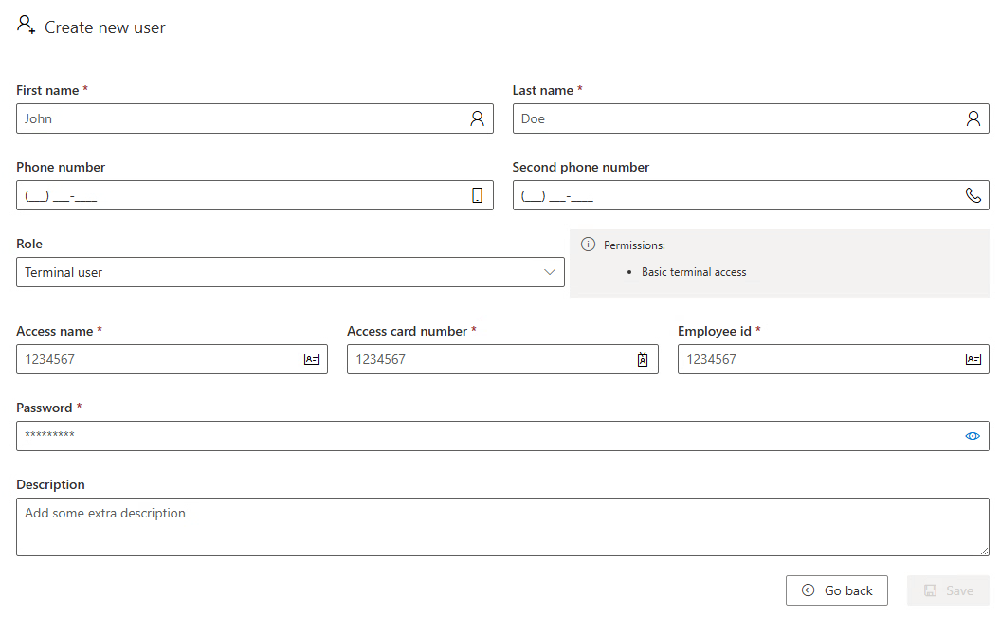

# User Manager

**[Home](../../index.md) > [Main Screens](../index.md) > [Administration](index.md) > User Manager**

The User Manager page allows Admin-level users to create and manage user accounts for InnoPick Manager.

---

## User Roles

Each user account is assigned one of these roles. When you select a role in the
Create or Edit User dialog, its permissions are listed beside the dropdown.

Roles are cumulative: each role includes every permission of the roles above it,
plus the one listed beside it.

| Role | Adds |
|------|------|
| **Terminal user** | Basic terminal access |
| **Operator** | Regular system operation actions, recovery actions and configurations |
| **Supervisor** | Advanced system operation actions, recovery actions and configurations |
| **Admin** | Account and system access management |
| **Technical Support** | Technical support configurations and recovery actions |

**Guest**: View-only access to browse screens.

:::note\{title="Terminal user"}
Terminal user grants access only to MixMaster Terminals. There are no Terminals
within InnoPick Manager, but since User Accounts are shared between the systems,
the option appears here.
:::

---

## Creating a New User

To create a new user account:

1. Click "Create New User" or similar button
2. Enter required information:
    - **Username**: Login identifier
    - **Password**: Initial password
    - **Full Name**: User's actual name
    - **Email**: Contact email address
    - **Role**: Select from Terminal user, Operator, Supervisor, Admin, Technical Support
3. Save the new user

---

## Managing Existing Users

From the User Manager page, you can:

- View all user accounts
- Edit user information
- Change user roles
- Disable or delete accounts
- Reset passwords

---

## Security Best Practices

- Assign the minimum necessary role for each user
- Review user accounts periodically
- Disable accounts for personnel no longer needing access
- Use strong passwords
- Change default passwords immediately

